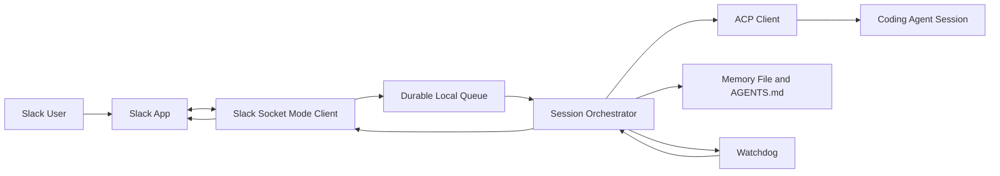

# CoderClaw

CoderClaw is a local-first agentic coding system that runs the orchestration service on the user's machine while letting the user interact through a communication app. The first channel is Slack. Coding agents are reached through ACP (Agent Client Protocol).

The long-term design stays agent-agnostic by treating ACP as the boundary between CoderClaw and coding agents.

## 1. Why This Exists

Most coding agents assume the user is operating the terminal directly. CoderClaw separates those concerns:

- the agent runtime stays on the local machine
- the user communicates through Slack
- a local Python service coordinates thread-scoped sessions, queueing, supervision, and recovery
- ACP carries messages between CoderClaw and the selected coding agent
- the system can improve its own memory, instructions, and code under controlled rules

## 2. Current Bootstrap

The repository now includes a minimal Python service with:

- a Slack Socket Mode client
- a durable local message queue with active session recovery
- a session orchestrator
- a Codex CLI runtime adapter from the earlier bootstrap
- structured execution metadata on successful agent calls
- a watchdog thread for stale-component and source-change detection
- a local health endpoint
- repo-root `AGENTS.md` plus Markdown memory files, with only skills kept under `.coder_home`

The implementation stays intentionally small, but Slack integration now uses the official Slack SDK because Socket Mode is the cleanest way to avoid exposing a public webhook URL from the user's laptop.

## 3. System Model



## 4. Repository Layout

```text
.
.coder_home/
  skills/
    <skill>/
      SKILL.md
AGENTS.md
MEMORY.md
memory/
  daily/
src/
  coderclaw/
    acp/
    channels/
    runtimes/
    config.py
    memory.py
    orchestrator.py
    policy.py
    queue.py
    server.py
    watchdog.py
```

## 5. Local Setup

CoderClaw should be run with Python 3.11 inside a local virtual environment.

```bash
scripts/install.sh
```

Set the required environment variables in your shell or `.env` loader of choice:

- `SLACK_BOT_TOKEN`
- `SLACK_APP_TOKEN`

Useful optional variables:

- `CODERCLAW_HOST`
- `CODERCLAW_PORT`
- `CODERCLAW_REPO_ROOT`
- `CODERCLAW_HOME_ROOT`
- `CODERCLAW_MEMORY_FILE`
- `CODERCLAW_DAILY_MEMORY_DIR`
- `CODERCLAW_QUEUE_STATE_FILE`
- `CODERCLAW_SESSION_ARCHIVE_DIR`
- `CODERCLAW_RESTART_LOCK_FILE`
- `CODERCLAW_CODEX_BIN`
- `CODERCLAW_CODEX_TIMEOUT_SECONDS`

## 6. Run The Service

```bash
scripts/start.sh
```

By default the local health server listens on `http://127.0.0.1:8787`.

`scripts/start.sh` launches CoderClaw in the background via `nohup` and writes logs to timestamped files under `.coderclaw/logs/`.

## 6.1 Shared Agent Home

CoderClaw uses a shared project-local `.coder_home` directory for coding agent products.

Current convention:

- `.coder_home/` is reserved for skills
- `.coder_home/skills/` stores portable Markdown-first skills
- `.agents/skills` symlinks to `.coder_home/skills` for Codex-compatible repo-level discovery
- repo-root `AGENTS.md` is the static prompt entrypoint
- repo-root `MEMORY.md` is canonical long-term memory

CoderClaw does not inject a custom `CODEX_HOME` when launching Codex.

This keeps project-specific skills in the agent home while preserving repo-root prompt and memory files that are visible to agent products using `AGENTS.md` conventions.

Important operational note:

- treat `.coder_home` as skills storage only
- do not treat `.coder_home` as the canonical source for steering or memory
- do not commit auth tokens, caches, or generated logs from agent CLIs

## 6.2 Markdown Usage Model

CoderClaw keeps static prompt guidance directly in `AGENTS.md`, while dynamic memory and skills remain separate:

The repository conventions are:

- `AGENTS.md`
  - direct static prompt file consumed by coding agents that honor `AGENTS.md`
  - keeps references to dynamic context rather than embedding that context directly
- `MEMORY.md`
  - curated long-term memory
  - use for durable facts, stable preferences, and lasting design decisions
- `memory/daily/YYYY-MM-DD.md`
  - daily working memory
  - use for short-horizon notes, current context, and observations that may later be promoted to `MEMORY.md`
- `.coder_home/skills/<skill>/SKILL.md`
  - canonical portable skill format
  - keeps skills Markdown-first and adaptable across different coding agent products while following the chosen agent's home/skills convention
  - for any new coding agent choice, first consult that agent's official guide for repo-, project-, or workspace-level skills setup
  - for Codex, the official skills guide is `https://developers.openai.com/codex/skills`
  - in this repo, Codex-compatible discovery is provided via `.agents/skills -> .coder_home/skills`
- `conclude the session` means updating the relevant Markdown files to reflect current project status, then creating a git commit

CoderClaw keeps dynamic context discoverable rather than eagerly injected:

- `AGENTS.md` references `MEMORY.md`, `memory/daily/YYYY-MM-DD.md`, and `.coder_home/skills/...`
- the coding agent chooses whether to open those files for the current task
- if a task implies `remember this`, the agent should update the appropriate Markdown memory file as part of the task
- memory updates happen through normal file edits
- CoderClaw does not currently implement OpenClaw-style programmatic pre-compaction memory flushing

## 7. Set Up The Slack Bot

Use the repo-root [manifest.json](/Users/kwang/Documents/workspaces/CoderClaw/manifest.json) to create the Slack app instead of configuring the app manually in the UI.

1. Open `api.slack.com/apps`.
2. Choose `Create New App`.
3. Choose `From an app manifest`.
4. Select the target workspace.
5. Paste the contents of `manifest.json`.
6. Review and create the app.
7. Install the app to the workspace and copy the `Bot User OAuth Token`.
8. Export the value before starting the server:

```bash
export SLACK_BOT_TOKEN=xoxb-...
```

9. Under `Basic Information`, create an app-level token with the scope `connections:write`.
10. Copy the app-level token and export it as `SLACK_APP_TOKEN`.
11. Confirm the manifest-applied settings in Slack:
   - bot scopes: `app_mentions:read`, `chat:write`, `reactions:write`, `im:history`
   - bot events: `app_mention`, `message.im`
   - App Home messages tab: enabled
   - Socket Mode: enabled
12. Reinstall the app if Slack asks for updated permissions.
13. Add the app to a channel in Slack.
14. Mention the bot in that channel or send it a direct message.

The current manifest also includes a concrete `event_subscriptions.request_url`, but CoderClaw uses Socket Mode for normal operation. Treat that URL as environment-specific and update or remove it as appropriate for your workspace.

You can also automate manifest-based app management from the shell with:

```bash
export SLACK_CONFIG_TOKEN=xoxe.xoxp-...
scripts/slack-app-validate.sh
scripts/slack-app-create.sh
```

To update an existing app from the same manifest:

```bash
export SLACK_CONFIG_TOKEN=xoxe.xoxp-...
export SLACK_APP_ID=A0123456789
scripts/slack-app-update.sh
```

These scripts manage the app manifest, but they do not eliminate all manual Slack steps:

- you still need to obtain `SLACK_CONFIG_TOKEN` from Slack
- you still need the app-level `SLACK_APP_TOKEN` (`xapp-...`) from Slack
- you may still need to complete workspace install/consent using the returned OAuth authorize URL

Example:

```text
@CoderClaw summarize the current README and suggest the next scaffold step
```

Direct-message example:

```text
summarize this repo and suggest the next change
```

## 8. Slack Integration

Current HTTP routes:

- `GET /healthz`

Current Slack behavior:

- opens an outbound Socket Mode connection to Slack using `SLACK_APP_TOKEN`
- recommends Slack app creation from `manifest.json` so scopes and events stay aligned with the repo
- accepts `app_mention` events in channels
- accepts direct messages through `message.im`
- normalizes the message text into a queue message
- persists queued messages and active session metadata to local disk
- appends each handled session exchange to `.coderclaw/sessions/`
- restores queued and interrupted active messages after process restart
- automatically restarts on watched source/doc changes after active and queued sessions have completed
- builds agent input from the relevant Slack thread context
- treats each Slack thread as a distinct coding-agent session
- keeps the communication app as a relay for messages into and out of the agent session
- reacts with `:eyes:` while a request is running
- replaces the status reaction with `:white_check_mark:` on success or `:x:` on failure
- sends the message context to the configured ACP-backed coding-agent session
- posts the result back into the same Slack thread

## 9. ACP Agent Sessions

The intended agent boundary is ACP (Agent Client Protocol).

Each communication thread maps to a new coding-agent session. The session context should be exactly the context visible in that thread, plus the repo's static prompt contract and any dynamic Markdown files the agent chooses to inspect for the task.

CoderClaw should not maintain hidden cross-thread agent context. Durable state belongs in explicit project files such as `MEMORY.md`, daily memory files, source files, and session archives.

## 10. Self-Improvement Principles

- Prefer instruction and memory refinement before invasive code mutation.
- Keep persistent memory separate from task-local conversation state.
- Require explicit policy boundaries around self-modification.
- Preserve an audit trail of changes and their rationale.
- Design for reversibility where practical.

## 11. Near-Term Next Steps

1. Add structured audit logging.
2. Replace the legacy Codex CLI adapter with a real ACP transport implementation.
3. Add configurable ACP agent selection and session startup settings.
4. Expand Slack handling beyond `app_mention`.
5. Decide how self-improvement changes are reviewed and applied.

## 12. Current Status

This is now a runnable bootstrap rather than documentation only. It is still an early skeleton, and the project direction has shifted from direct CLI runtime wrapping toward ACP-backed coding-agent sessions.

Current repository conventions are:

- static prompt guidance lives directly in repo-root `AGENTS.md`
- durable project memory lives in repo-root `MEMORY.md`
- `.coder_home/skills/` is the shared skills store
- `.agents/skills -> .coder_home/skills` provides Codex-compatible repo-level skill discovery
- CoderClaw does not set a custom `CODEX_HOME`
- `src/coderclaw/acp/` contains the internal ACP-facing agent client boundary
- the current executable agent adapter is still the legacy Codex CLI adapter behind that boundary
- each communication thread should map to a distinct coding-agent session
- communication apps should relay messages into and out of ACP-backed agent sessions
- `scripts/install.sh` bootstraps the local environment with `python >= 3.11`
- `scripts/start.sh` runs CoderClaw in the background via `nohup` and writes timestamped logs under `.coderclaw/logs/`
- handled sessions are archived under `.coderclaw/sessions/`
- automatic restart on watched file changes uses a restart lock at `.coderclaw/state/restart.lock` and waits for in-flight sessions to finish
- Slack app setup is manifest-driven from repo-root `manifest.json`
