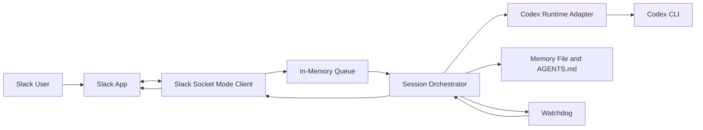

# CoderClaw

CoderClaw is a local-first agentic coding system that runs the agent and server on the user's machine while letting the user interact through a communication app. The first channel is Slack. The first execution runtime is Codex.

The long-term design remains runtime-agnostic so the orchestration layer can support other coding agents such as Claude Code, Gemini CLI, and Kiro CLI.

## 1. Why This Exists

Most coding agents assume the user is operating the terminal directly. CoderClaw separates those concerns:

- the agent runtime stays on the local machine
- the user communicates through Slack
- a local Python service coordinates sessions, queueing, supervision, and recovery
- the system can improve its own memory, instructions, and code under controlled rules

## 2. Current Bootstrap

The repository now includes a minimal Python service with:

- a Slack Socket Mode client
- an in-memory message queue
- a session orchestrator
- a Codex runtime adapter
- a watchdog thread for stale-component and source-change detection
- a local health endpoint
- Markdown steering and memory files loaded from `.coder_home`, with daily memory kept outside it

The implementation stays intentionally small, but Slack integration now uses the official Slack SDK because Socket Mode is the cleanest way to avoid exposing a public webhook URL from the user's laptop.

## 3. System Model



## 4. Repository Layout

```text
.
.coder_home/
  AGENTS.md
  MEMORY.md
  skills/
    <skill>/
      SKILL.md
memory/
  daily/
src/
  coderclaw/
    channels/
    runtimes/
    config.py
    memory.py
    orchestrator.py
    policy.py
    queue.py
    server.py
    watchdog.py
```

## 5. Local Setup

CoderClaw should be run with Python 3.11 inside a local virtual environment.

```bash
python3.11 -m venv .venv
source .venv/bin/activate
pip install -e .
cp .env.example .env
```

Set the required environment variables in your shell or `.env` loader of choice:

- `SLACK_BOT_TOKEN`
- `SLACK_APP_TOKEN`

Useful optional variables:

- `CODERCLAW_HOST`
- `CODERCLAW_PORT`
- `CODERCLAW_REPO_ROOT`
- `CODERCLAW_HOME_ROOT`
- `CODERCLAW_CODEX_HOME`
- `CODERCLAW_MEMORY_FILE`
- `CODERCLAW_DAILY_MEMORY_DIR`
- `CODERCLAW_CODEX_BIN`
- `CODERCLAW_CODEX_TIMEOUT_SECONDS`

## 6. Run The Service

```bash
source .venv/bin/activate
export SLACK_BOT_TOKEN=...
export SLACK_APP_TOKEN=...
coderclaw
```

By default the local health server listens on `http://127.0.0.1:8787`.

## 6.1 Shared Agent Home

CoderClaw uses a shared project-local `.coder_home` directory for coding agent products.

Current convention:

- `.coder_home/` is the shared agent-home root
- `.coder_home/AGENTS.md` is canonical steering
- `.coder_home/MEMORY.md` is canonical long-term memory
- `.coder_home/skills/` stores portable Markdown-first skills
- `.codex` can be a convenience symlink to `.coder_home` when needed

When CoderClaw launches Codex, it sets:

```text
CODEX_HOME=.coder_home
```

This keeps project-specific steering close to the repository while preserving a path for future agent-specific conventional names through symlinks.

Important operational note:

- treat `.coder_home` as local runtime state
- do not treat `.coder_home` as the canonical source for steering or memory
- do not commit auth tokens, caches, or generated logs from agent CLIs

## 6.2 Markdown Usage Model

CoderClaw now uses an OpenClaw-inspired Markdown layout with one deliberate simplification: steering stays merged into a single `AGENTS.md`.

The repository conventions are:

- `.coder_home/AGENTS.md`
  - canonical merged steering file
  - absorbs the role we would otherwise split across extra files such as `SOUL.md` and `TOOLS.md`
- `.coder_home/MEMORY.md`
  - curated long-term memory
  - use for durable facts, stable preferences, and lasting design decisions
- `memory/daily/YYYY-MM-DD.md`
  - daily working memory
  - use for short-horizon notes, current context, and observations that may later be promoted to `.coder_home/MEMORY.md`
- `.coder_home/skills/<skill>/SKILL.md`
  - canonical portable skill format
  - keeps skills Markdown-first and adaptable across different coding agent products

CoderClaw adopts the memory self-updating behavior at the agent-instruction level:

- if a task implies `remember this`, the agent should update the appropriate Markdown memory file as part of the task
- memory updates happen through normal file edits
- CoderClaw does not currently implement OpenClaw-style programmatic pre-compaction memory flushing

## 7. Set Up The Slack Bot

1. Create a Slack app at `api.slack.com/apps`.
2. Choose the workspace where you want to test CoderClaw.
3. Under `OAuth & Permissions`, add these bot token scopes:
   - `app_mentions:read`
   - `chat:write`
   - `reactions:write`
4. Install the app to the workspace and copy the `Bot User OAuth Token`.
5. Export the value before starting the server:

```bash
export SLACK_BOT_TOKEN=xoxb-...
```

6. Under `Basic Information`, create an app-level token with the scope `connections:write`.
7. Copy the app-level token and export it as `SLACK_APP_TOKEN`.
8. Under `Socket Mode`, enable Socket Mode for the app.
9. Under `App Home`, turn on the `Messages Tab` if you want direct messages to work.
10. Under `Event Subscriptions`, enable events.
11. Subscribe to these bot events:
   - `app_mention`
   - `message.im`
12. Click `Save changes`.
13. Reinstall the app if Slack asks for updated permissions.
14. Add the app to a channel in Slack.
15. Mention the bot in that channel or send it a direct message.

Example:

```text
@CoderClaw summarize the current README and suggest the next scaffold step
```

Direct-message example:

```text
summarize this repo and suggest the next change
```

## 8. Slack Integration

Current HTTP routes:

- `GET /healthz`

Current Slack behavior:

- opens an outbound Socket Mode connection to Slack using `SLACK_APP_TOKEN`
- accepts `app_mention` events in channels
- accepts direct messages through `message.im`
- normalizes the message text into a queue message
- reacts with `:eyes:` while a request is running
- replaces the status reaction with `:white_check_mark:` on success or `:x:` on failure
- runs the message through the Codex runtime adapter
- posts the result back into the same Slack thread

## 9. Codex Runtime

The first runtime adapter shells out to:

```bash
codex exec -s danger-full-access --skip-git-repo-check "$PROMPT"
```

CoderClaw runs Codex with a project-local `CODEX_HOME` rooted at `.coder_home`.

This is an implementation detail behind the runtime boundary, not a permanent system constraint.

## 10. Self-Improvement Principles

- Prefer instruction and memory refinement before invasive code mutation.
- Keep persistent memory separate from task-local conversation state.
- Require explicit policy boundaries around self-modification.
- Preserve an audit trail of changes and their rationale.
- Design for reversibility where practical.

## 11. Near-Term Next Steps

1. Replace the in-memory queue with a durable queue.
2. Add session persistence and structured audit logging.
3. Add a second channel or a second runtime to validate the abstractions.
4. Expand Slack handling beyond `app_mention`.
5. Decide how self-improvement changes are reviewed and applied.

## 12. Current Status

This is now a runnable bootstrap rather than documentation only. It is still an early skeleton, but the core boundaries for Slack intake, orchestration, Codex execution, memory, and watchdog supervision are in place.
