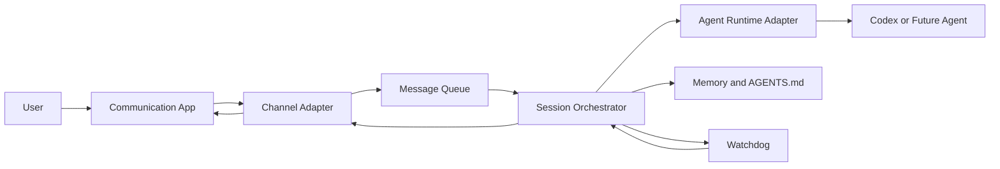

# CoderClaw

CoderClaw is a local-first agentic coding system that runs the agent and server on the user's own machine while letting the user interact through external communication tools such as Slack, Discord, and email.

The first execution engine is Codex. The long-term design is runtime-agnostic so the same orchestration layer can support other coding agents such as Claude Code, Gemini CLI, and Kiro CLI.

## Why This Exists

Most coding agents assume the user is sitting in front of the terminal where the agent runs. CoderClaw separates those concerns:

- the agent runtime stays on the local machine
- the user communicates through a messaging surface
- a local server coordinates sessions, queueing, supervision, and recovery
- the system can improve its own memory, instructions, and code under controlled rules

## Core Capabilities

- Local execution of coding agents
- Messaging-based request and response flow
- Centralized message queue for channel integrations
- Watchdog supervision for reliability
- Persistent memory and agent instruction management
- Controlled self-improvement of docs, memory, and code
- Future support for multiple agent runtimes behind one orchestration layer

## Initial Runtime

The first supported runtime is Codex, invoked from the host machine.

Example:

```bash
codex exec --skip-git-repo-check "$PROMPT"
```

This should be treated as an adapter implementation detail, not the final system boundary.

## System Model



## Main Components

### 1. Channel adapters

Adapters normalize incoming and outgoing messages for services like Slack, Discord, and email. They should translate provider-specific payloads into a shared internal format.

### 2. Message queue

The queue is the central transport layer between channel adapters and orchestration. It should support ordering, retries, deduplication, and recovery after restarts.

### 3. Agent runtime adapters

Each coding agent should be wrapped behind a stable runtime contract. The first implementation targets Codex, with room for future adapters for Claude Code, Gemini CLI, and Kiro CLI.

### 4. Session orchestrator

The orchestrator turns queued messages into agent sessions, manages state transitions, persists task context, and sends responses back through the appropriate channel.

### 5. Watchdog

The watchdog monitors the local server and agent execution loop. It should detect stuck processes, failed subprocesses, and relevant source changes, then trigger safe restart or recovery behavior.

### 6. Memory and self-improvement

The system should be able to improve itself through:

1. updating `AGENTS.md` and persistent memory files
2. modifying the codebase directly

This must remain controlled, reviewable, and auditable.

## Self-Improvement Principles

- Prefer instruction and memory refinement before invasive code mutation.
- Keep persistent memory separate from task-local conversation state.
- Require explicit policy boundaries around self-modification.
- Preserve an audit trail of changes and their rationale.
- Design for reversibility where practical.

## Design Principles

- Local-first by default
- Adapter-based architecture
- Reliability before feature breadth
- Clear separation between messaging, orchestration, runtime control, and policy
- Incremental path from one runtime to many

## Suggested Repository Shape

```text
docs/
src/
  channels/
  queue/
  runtimes/
  orchestrator/
  watchdog/
  memory/
  policy/
scripts/
tests/
```

## Suggested Early Milestones

1. Bootstrap the server process and project structure.
2. Implement the Codex runtime adapter.
3. Add one channel integration end to end.
4. Add a durable internal message queue.
5. Add watchdog supervision and restart logic.
6. Define persistent memory files and self-improvement policy.
7. Add a second agent runtime to validate the abstraction.

## Open Questions

- Which communication app should be the first production integration?
- How much autonomy should self-improvement have before human review is required?
- Should the watchdog trigger hot reload, process restart, or both?
- What storage backend should back the queue and persistent memory in the first version?
- What is the minimum common runtime contract across Codex and future agents?

## Current Status

This repository is at the definition stage. The first goal is to establish the documentation, operating constraints, and architecture before implementing the initial local end-to-end loop.
