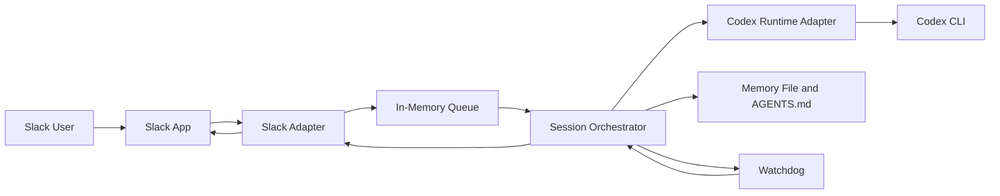

# CoderClaw

CoderClaw is a local-first agentic coding system that runs the agent and server on the user's machine while letting the user interact through a communication app. The first channel is Slack. The first execution runtime is Codex.

The long-term design remains runtime-agnostic so the orchestration layer can support other coding agents such as Claude Code, Gemini CLI, and Kiro CLI.

## 1. Why This Exists

Most coding agents assume the user is operating the terminal directly. CoderClaw separates those concerns:

- the agent runtime stays on the local machine
- the user communicates through Slack
- a local Python service coordinates sessions, queueing, supervision, and recovery
- the system can improve its own memory, instructions, and code under controlled rules

## 2. Current Bootstrap

The repository now includes a minimal Python service with:

- a Slack events endpoint
- an in-memory message queue
- a session orchestrator
- a Codex runtime adapter
- a watchdog thread for stale-component and source-change detection
- a persistent memory file used during prompt construction

The implementation is intentionally small and stdlib-first so the first end-to-end loop stays easy to run locally.

## 3. System Model



## 4. Repository Layout

```text
.
.coder_home/
  shared/
  codex/
memory/
  system.md
src/
  coderclaw/
    channels/
    runtimes/
    config.py
    memory.py
    orchestrator.py
    policy.py
    queue.py
    server.py
    watchdog.py
```

## 5. Local Setup

CoderClaw should be run with Python 3.11 inside a local virtual environment.

```bash
python3.11 -m venv .venv
source .venv/bin/activate
pip install -e .
cp .env.example .env
```

Set the required environment variables in your shell or `.env` loader of choice:

- `SLACK_BOT_TOKEN`
- `SLACK_SIGNING_SECRET`

Useful optional variables:

- `CODERCLAW_HOST`
- `CODERCLAW_PORT`
- `CODERCLAW_REPO_ROOT`
- `CODERCLAW_HOME_ROOT`
- `CODERCLAW_CODEX_HOME`
- `CODERCLAW_MEMORY_FILE`
- `CODERCLAW_CODEX_BIN`
- `CODERCLAW_CODEX_TIMEOUT_SECONDS`

## 6. Run The Service

```bash
source .venv/bin/activate
export SLACK_BOT_TOKEN=...
export SLACK_SIGNING_SECRET=...
coderclaw
```

By default the service listens on `http://127.0.0.1:8787`.

## 6.1 Shared Agent Home

CoderClaw uses a shared project-local `.coder_home` directory for coding agent products.

Current convention:

- `.coder_home/shared/` for cross-agent project-local resources
- `.coder_home/codex/` as the Codex-specific home
- `.codex` as a convenience symlink to `.coder_home/codex` when available

When CoderClaw launches Codex, it sets:

```text
CODEX_HOME=.coder_home/codex
```

This keeps project-specific steering close to the repository while preserving a path for future agent-specific homes such as `.coder_home/claude-code/` or `.coder_home/gemini/`.

Important operational note:

- treat `.coder_home` as local runtime state
- commit only intentional steering files such as tracked `README.md` and `AGENTS.md`
- do not commit auth tokens, caches, or generated logs from agent CLIs

## 7. Set Up The Slack Bot

1. Create a Slack app at `api.slack.com/apps`.
2. Choose the workspace where you want to test CoderClaw.
3. Under `Basic Information`, copy the `Signing Secret`.
4. Under `OAuth & Permissions`, add these bot token scopes:
   - `app_mentions:read`
   - `chat:write`
5. Install the app to the workspace and copy the `Bot User OAuth Token`.
6. Export the values before starting the server:

```bash
export SLACK_BOT_TOKEN=xoxb-...
export SLACK_SIGNING_SECRET=...
```

7. Expose your local service to Slack.

If you are testing from your laptop, Slack needs a public HTTPS URL that forwards to your local server. A common option is:

```bash
cloudflared tunnel --url http://127.0.0.1:8787
```

You can use any equivalent tunnel as long as Slack can reach `POST /slack/events`.

8. In Slack app settings, open `Event Subscriptions` and enable events.
9. Set the request URL to:

```text
https://your-public-url/slack/events
```

Slack will send a URL verification request, which the current server handles automatically.

10. Subscribe to the bot event `app_mention`.
11. Click `Save changes`.
12. Reinstall the app if Slack asks for updated permissions.
13. Add the app to a channel in Slack.
14. Mention the bot in that channel with a coding request.

Example:

```text
@CoderClaw summarize the current README and suggest the next scaffold step
```

## 8. Slack Integration

Current HTTP routes:

- `GET /healthz`
- `POST /slack/events`

Current Slack behavior:

- responds to Slack URL verification requests
- verifies Slack request signatures when `SLACK_SIGNING_SECRET` is set
- accepts `app_mention` events
- normalizes the mention text into a queue message
- runs the message through the Codex runtime adapter
- posts the result back into the same Slack thread

## 9. Codex Runtime

The first runtime adapter shells out to:

```bash
codex exec --skip-git-repo-check "$PROMPT"
```

CoderClaw runs Codex with a project-local `CODEX_HOME` rooted at `.coder_home/codex`.

This is an implementation detail behind the runtime boundary, not a permanent system constraint.

## 10. Self-Improvement Principles

- Prefer instruction and memory refinement before invasive code mutation.
- Keep persistent memory separate from task-local conversation state.
- Require explicit policy boundaries around self-modification.
- Preserve an audit trail of changes and their rationale.
- Design for reversibility where practical.

## 11. Near-Term Next Steps

1. Replace the in-memory queue with a durable queue.
2. Add session persistence and structured audit logging.
3. Add a second channel or a second runtime to validate the abstractions.
4. Expand Slack handling beyond `app_mention`.
5. Decide how self-improvement changes are reviewed and applied.

## 12. Current Status

This is now a runnable bootstrap rather than documentation only. It is still an early skeleton, but the core boundaries for Slack intake, orchestration, Codex execution, memory, and watchdog supervision are in place.
