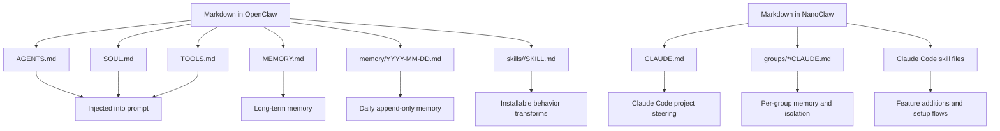
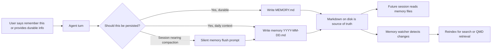
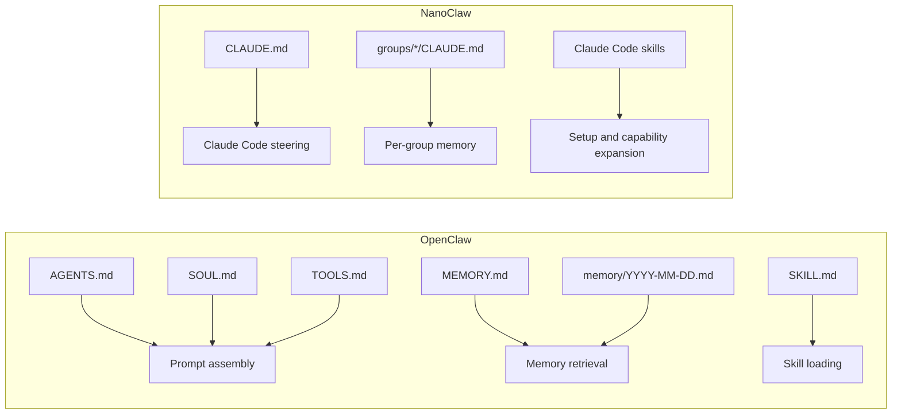
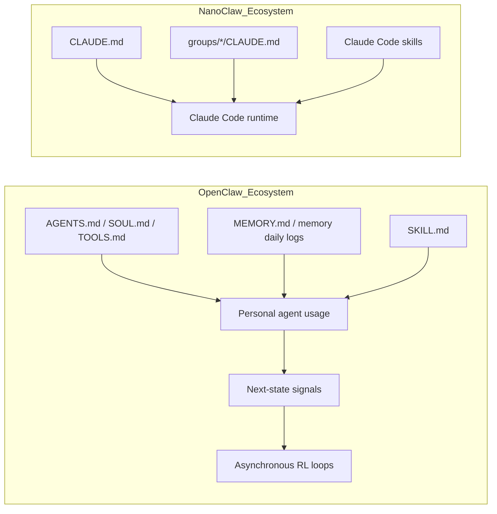

# OpenClaw vs NanoClaw: Markdown Files and How They Are Used

## 1. Scope

This report compares the Markdown files that OpenClaw and NanoClaw publicly document as part of their runtime behavior.

It focuses on two questions:

1. Which Markdown files do they use?
2. How do they use those files at runtime?

I used public docs and official repository pages available on April 12, 2026.

## 2. Executive Summary

- OpenClaw uses a broader Markdown workspace model.
- NanoClaw uses a narrower Claude Code-centric model centered on `CLAUDE.md`.
- OpenClaw explicitly documents injected instruction files plus Markdown-backed memory and Markdown skills.
- NanoClaw explicitly documents per-group `CLAUDE.md` memory and Claude Code skills; its public docs emphasize code customization more than a large file taxonomy.
- The OpenClaw-RL paper is relevant to the comparison, but it does not introduce additional Markdown files; instead, it shows how OpenClaw is positioned as a continuously improving personal-agent environment whose interaction records and next-state signals can feed an asynchronous learning loop.

## 3. High-Level Comparison



## 4. OpenClaw

### 4.1 Markdown files explicitly documented as runtime-relevant

OpenClaw explicitly documents these Markdown files as part of the agent workspace/runtime:

- `AGENTS.md`
- `SOUL.md`
- `TOOLS.md`
- `MEMORY.md`
- `memory/YYYY-MM-DD.md`
- `skills/<skill>/SKILL.md`

OpenClaw also exposes many other Markdown templates in its docs navigation, including `BOOT.md`, `IDENTITY.md`, `USER.md`, `HEARTBEAT.md`, `GOALS.md`, and `SOUVENIR.md`. However, from the sources used here, the files above are the ones whose runtime role is stated most clearly.

### 4.2 How OpenClaw uses them

#### Injected prompt files

OpenClaw’s repo README says the workspace root is `~/.openclaw/workspace` and lists these as injected prompt files:

- `AGENTS.md`
- `SOUL.md`
- `TOOLS.md`

That means these files are not just documentation; they are loaded into the agent’s effective prompt context.

#### Memory files

OpenClaw’s memory docs say memory is plain Markdown in the agent workspace and that the files are the source of truth.

It describes a default two-layer memory layout:

- `memory/YYYY-MM-DD.md`
  - append-only daily log
  - today + yesterday are read at session start
- `MEMORY.md`
  - curated long-term memory
  - only loaded in the main private session, not in group contexts

The docs also state:

- durable facts and preferences should go to `MEMORY.md`
- day-to-day notes go to `memory/YYYY-MM-DD.md`
- OpenClaw can vector-index `MEMORY.md` and `memory/*.md`
- with the QMD backend enabled, Markdown remains the source of truth and QMD is used only for retrieval/indexing

#### How OpenClaw updates memory

OpenClaw’s memory-update mechanism is important enough to separate from simple “memory exists on disk.”

The update path is:

1. the model decides something should be remembered
2. the model writes that memory into Markdown files in the workspace
3. OpenClaw later reads those files back as memory context
4. the memory-search layer watches those files and reindexes them for retrieval

In other words, OpenClaw does not treat memory as hidden internal state. It treats Markdown files on disk as the canonical persistence layer.

There are three distinct mechanisms involved:

##### A. Direct memory writing by the agent

The docs explicitly say:

- if someone says “remember this,” the agent should write it down
- durable facts, preferences, and decisions should go to `MEMORY.md`
- running notes and short-horizon context should go to `memory/YYYY-MM-DD.md`

So the core update mechanism is straightforward file mutation: the agent writes Markdown.

##### B. Automatic memory flush before compaction

OpenClaw also has an automatic pre-compaction memory flush.

When a session approaches auto-compaction, OpenClaw triggers a silent agentic turn that reminds the model to store durable memory before the existing conversation context is compacted. The default config shows:

- `agents.defaults.compaction.memoryFlush.enabled`
- `softThresholdTokens`
- a system prompt that says the session is nearing compaction
- a prompt telling the model to write lasting notes to `memory/YYYY-MM-DD.md`
- `NO_REPLY` behavior so the user usually does not see this turn

This is not search or indexing. It is a prompt-time mechanism to get the agent to persist useful memory to Markdown before transient context is discarded.

##### C. Reindexing after memory files change

OpenClaw’s memory search layer then watches memory files for changes and updates retrieval structures.

The docs say memory search:

- can vector-index `MEMORY.md` and `memory/*.md`
- watches memory files for changes
- can use the built-in indexer or QMD as the retrieval backend

This matters because it is easy to confuse “updating memory” with “updating the search index.” They are not the same thing.

The proper model is:

- writing Markdown files updates the memory itself
- rebuilding embeddings or BM25/vector indexes updates retrieval over that memory

##### D. What the RL paper does and does not change

The OpenClaw-RL paper describes online learning from interaction traces and next-state signals, but that is a different mechanism from OpenClaw’s Markdown memory updates.

So there are two separate layers:

- Markdown memory update:
  - persistent user-facing/agent-facing memory stored in files
- RL / next-state learning:
  - model-improvement signals derived from interactions

The paper helps explain OpenClaw’s self-improving architecture, but it should not be mistaken for the mechanism that updates `MEMORY.md` or `memory/YYYY-MM-DD.md`.

#### OpenClaw memory update flow



#### Skills

OpenClaw documents skills as directories containing `SKILL.md`, under:

```text
~/.openclaw/workspace/skills/<skill>/SKILL.md
```

So `SKILL.md` is the unit of skill behavior distribution and loading.

### 4.3 OpenClaw operational model

OpenClaw’s public model is:

- steering via injected Markdown files
- memory via Markdown files on disk
- retrieval/indexing layered on top of those Markdown files
- skill packaging via `SKILL.md`

In short, OpenClaw treats Markdown as both prompt configuration and persistent memory substrate.

### 4.4 Why this matters in the comparison

This is one of the sharpest differences between OpenClaw and NanoClaw.

OpenClaw publicly documents an explicit memory-maintenance loop around Markdown:

- memory is written to Markdown files
- memory is flushed before compaction
- retrieval indexes are refreshed when files change

NanoClaw also uses Markdown for memory, especially `groups/*/CLAUDE.md`, but in the sources used here it does not document an equally explicit built-in mechanism like OpenClaw’s pre-compaction memory flush plus file-watching retrieval layer.

## 5. NanoClaw

### 5.1 Markdown files explicitly documented as runtime-relevant

NanoClaw’s official site and repo explicitly point to:

- `CLAUDE.md`
- `groups/*/CLAUDE.md`
- Claude Code skill files

The repository root also contains a top-level `CLAUDE.md`, and the repo includes a `.claude` directory. The public README strongly frames NanoClaw as a Claude Code-native system, so `CLAUDE.md` is the central steering/memory file in its documented model.

### 5.2 How NanoClaw uses them

#### Per-group memory

NanoClaw’s site says each group maintains isolated context with individual `CLAUDE.md` memory files.

Its GitHub README is more specific:

- each group has its own `CLAUDE.md` memory
- each group has an isolated filesystem
- each group runs in its own container sandbox
- `groups/*/CLAUDE.md` is listed as a key file for per-group memory

That makes `groups/*/CLAUDE.md` the primary runtime memory artifact described publicly.

#### Claude Code-native steering

NanoClaw’s public setup flow is:

```text
git clone ... && cd nanoclaw && claude
```

Then the user runs Claude Code skills such as `/setup`.

Because the runtime is built around Claude Code / Claude Agent SDK, the presence of top-level `CLAUDE.md` is best understood as Claude Code steering for the project itself, while `groups/*/CLAUDE.md` is the per-agent or per-group persistent memory layer.

This is partly an inference from the public structure and Claude Code conventions, but it matches NanoClaw’s own description of per-group memory.

#### Skills

NanoClaw’s README repeatedly says new capabilities should be added as Claude Code skills, for example:

- `/setup`
- `/add-whatsapp`
- `/add-telegram`
- `/customize`

So NanoClaw uses Markdown skill instructions indirectly through Claude Code’s skill mechanism rather than advertising its own separate Markdown skill taxonomy the way OpenClaw does.

## 6. Side-by-Side Table

| Product | Markdown file | Role | Publicly documented usage |
|---|---|---|---|
| OpenClaw | `AGENTS.md` | steering/instructions | injected prompt file |
| OpenClaw | `SOUL.md` | steering/personality | injected prompt file |
| OpenClaw | `TOOLS.md` | tool notes/instructions | injected prompt file |
| OpenClaw | `MEMORY.md` | long-term memory | curated memory, main private session only |
| OpenClaw | `memory/YYYY-MM-DD.md` | short-term daily memory | append-only daily log, read at session start |
| OpenClaw | `MEMORY.md` + `memory/*.md` | memory update mechanism | agent writes Markdown directly; pre-compaction memory flush prompts agent to persist memory |
| OpenClaw | `skills/<skill>/SKILL.md` | skill packaging | skill instructions loaded from workspace |
| NanoClaw | `CLAUDE.md` | project/agent steering | Claude Code-native project instruction file |
| NanoClaw | `groups/*/CLAUDE.md` | per-group memory | isolated context and memory per group |
| NanoClaw | Claude Code skill Markdown | setup/feature transforms | `/setup`, `/add-*`, `/customize` flows |

## 7. Main Architectural Difference



OpenClaw exposes a multi-file Markdown architecture as a first-class part of its own runtime design.

NanoClaw exposes a slimmer Markdown surface:

- `CLAUDE.md` for Claude Code-native steering
- `groups/*/CLAUDE.md` for isolated memory
- Claude Code skills for setup and extension

## 8. What The OpenClaw-RL Paper Adds To The Comparison

The paper `OpenClaw-RL: Train Any Agent Simply by Talking` is useful here because it clarifies what OpenClaw is optimizing around at the system level.

Important distinction:

- OpenClaw docs/repo describe the Markdown files and their runtime roles.
- The OpenClaw-RL paper describes the learning and serving architecture around an OpenClaw-style personal agent.

The paper does not add new Markdown file names like `AGENTS.md` or `MEMORY.md`. In fact, the paper text does not explicitly discuss Markdown files at all. What it does add is architectural context:

- OpenClaw is treated as a personal-agent environment hosted on personal devices.
- The framework uses next-state signals such as user replies, tool outputs, test verdicts, and GUI transitions as online learning signals.
- The system is designed as four decoupled asynchronous loops:
  - environment serving
  - reward judging
  - policy training
  - policy serving
- The paper distinguishes:
  - main-line turns, which become training samples
  - side turns, which include memory organization and auxiliary transitions, but are not used as training data
- The framework logs interactions and evaluations to JSONL in real time.

This matters for the Markdown comparison because OpenClaw’s Markdown files are not just passive instruction files in the ecosystem around OpenClaw. They sit inside a broader architecture where the agent can be continuously improved from live usage signals.

By contrast, NanoClaw’s public framing is centered on:

- Claude Code as the execution substrate
- `CLAUDE.md` as the main instruction/memory convention
- per-group isolation with `groups/*/CLAUDE.md`
- customization through code changes and skills

So the paper strengthens this comparison:

- OpenClaw: Markdown-backed steering and memory inside a larger online-learning architecture
- NanoClaw: Markdown-backed steering/memory inside a smaller Claude Code-native customization model

### 8.1 Architecture Overlay



## 9. Conclusion

If the question is "which product uses more explicit Markdown roles in its own documented architecture?", the answer is OpenClaw.

If the question is "which product centers its Markdown usage around Claude Code conventions?", the answer is NanoClaw.

The practical difference is:

- OpenClaw: Markdown is a visible multi-layer runtime contract.
- OpenClaw-RL adds that OpenClaw also sits inside a documented online-learning architecture, though the paper itself is not a Markdown-file spec.
- NanoClaw: Markdown is present, but the public model is more centered on Claude Code, container isolation, and small-codebase customization.

## 10. Sources

Primary sources used:

- OpenClaw GitHub README: https://github.com/openclaw/openclaw
- OpenClaw memory docs: https://openclawlab.com/en/docs/concepts/memory/
- OpenClaw-RL paper: https://arxiv.org/html/2603.10165v1
- NanoClaw official site: https://nanoclaw.net/
- NanoClaw GitHub README: https://github.com/qwibitai/nanoclaw

Notes:

- The statement that NanoClaw’s top-level `CLAUDE.md` is used as project steering is an inference from the repo structure plus Claude Code conventions; the per-group `groups/*/CLAUDE.md` memory role is explicitly documented.
- OpenClaw’s docs list additional Markdown templates beyond the files analyzed here, but this report only treats a file as "used" when the official docs/repo clearly describe its runtime role.
- The OpenClaw-RL paper is used here for architectural context only. It does not explicitly document Markdown files such as `AGENTS.md`, `MEMORY.md`, or `CLAUDE.md`.
